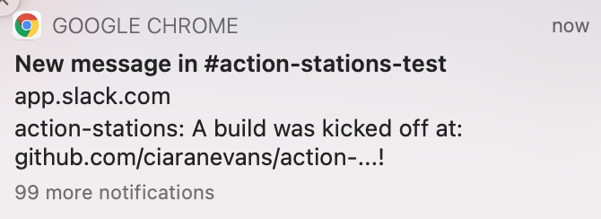

# Example 6 - GitHub Actions Action

## TL;DR:

Example 6 is a little different, rather than focussing on writing a workflow, we're looking at writing an actual GitHub Actions `Action` - the callable 'thing' we can use to do something.

The Action we make: `action-stations-slack` will ping our Slack channel every time a build is kicked off for this repository.

You can find more reading on making a GitHub Actions Action [here](https://docs.github.com/en/actions/creating-actions) - For this example I'm making a Docker Action.

## Code

The code for this example is within [`.github/actions/action-stations-slack/`](../.github/actions/action-stations-slack/).

### `Dockerfile`

[`Dockerfile`](../.github/actions/action-stations-slack/Dockerfile) contains the setup of the internals of the GitHub Action. It defines the base image, what dependencies to install, and the command to run when the Action is invoked.

A breakdown goes as follows:

```Dockerfile
FROM python:3.10.0b2-slim-buster # We only need a really lightweight image

RUN pip install slack-sdk==3.6.0 # We need the slack-sdk to send messages to Slack

COPY send_message.py /send_message.py # This copies our Action logic into the container

ENTRYPOINT ["python3", "/send_message.py"] # When the container is run, we run the send_message.py script
```

### `action.yaml`

[`action.yaml`](../.github/actions/action-stations-slack/action.yaml) is required by GitHub Actions to instruct the user as to what the Action does, needs, and outputs. It acts as a function definition almost, declaring the method, the input parameters, and the returned values.

A breakdown goes as follows:

```yaml
name: 'Action Stations Slack Poster' # The name of the Action
description: 'An action that posts to the provided channel that a build has been kicked off for the given URL' # A brief blurb of what this action does
inputs: # Here we define what we'll pass to our Action
  slack_bot_token: # This is for authentication with Slack
    description: 'The Bot User OAuth Token for the Slack App'
    required: true # We require it, we can also set a default value
  github_build_url: # This created in the workflow and sent to the channel
    description: 'The URL of the GitHub Actions Workflow running this Action'
    required: true
  slack_channel_id: # This is the ID of the channel we post our message to
    description: 'The Slack Channel ID for the bot to post to (CO*******)'
    required: true
runs: # This tells GitHub Actions how to run the Action
  using: 'docker' # We're making a Docker action (not a JavaScript Action)
  image: 'Dockerfile' # We're defining the image in a Dockerfile - we could just use a image name
  args: # These are the arguments we pass to the container when we run it
    - ${{ inputs.slack_bot_token }}
    - ${{ inputs.github_build_url }}
    - ${{ inputs.slack_channel_id }}
```

### `send_message.py`

[`send_message.py`](../.github/actions/action-stations-slack/send_message.py) is where our actual Action logic happens. We take the input values, create a message, and send that message to Slack. This isn't a great piece of code (no tests, no real formatting etc).

A breakdown goes as follows:

```python
import sys

from slack_sdk import WebClient

# This is the format of the message we'll send Slack - it is in mrkdwn format https://api.slack.com/reference/surfaces/formatting#basics
MESSAGE_FORMAT=(
    ":rotating_light: *ACTION STATIONS* :rotating_light: \n"
    "Someone just kicked off a build on `ciaranevans/action-stations`!\n"
    "You can take a look at the GitHub Actions Workflow by clicking"
    " <{0}|*HERE*> :sleuth_or_spy:"
)


def send_message(token: str, github_build_url: str, channel: str) -> None:
    client = WebClient(token=token) # Here we create the Client we'll talk to Slack with
    message = [
		{
			"type": "section",
			"text": {
				"type": "mrkdwn",
				"text": MESSAGE_FORMAT.format(github_build_url)
			}
		}
	] # We define a message block which is a nice way to make fancy looking Slack messages https://api.slack.com/reference/block-kit
    client.chat_postMessage(
        channel=channel,
        blocks=message,
        text=f"A build was kicked off at: {github_build_url}!"
    ) # We post the message, passing in `text` which is used in notification pop-ups

if __name__ == "__main__":
    send_message(sys.argv[1], sys.argv[2], sys.argv[3]) # We call `send_message` when the script is invoked
```

## Workflow

Within [`.github/workflows/example-6-actions-action.yaml`](../.github/workflows/example-6-actions-action.yaml), we're defining one Job: `send-slack-message` which does only two things:

* Checkout the code
* Invoke `send-slack-message`
  * Because the Action is local to the repository, we use a relative path in `uses`
  * If we wanted to use this Action from another repository, we'd either have it alone in a repo, then we could use: `uses: ciaranevans/action-stations-slack@main`, or we could also release it and use: `uses: ciaranevans/action-stations-slack@v1`
  * `slack_bot_token` and `slack_channel_id` are stored in our repositories secrets
  * We define `github_build_url` using the variables `github.repository` and `github.run_id` which are available to the workflows context

This workflow **only** runs when either a commit is pushed to the `main` branch, or when a pull request is raised against the `main` branch.

## What this looks like IRL

Here's what the notification looks like on Google Chrome:



Here's what the Slack message looks like (App logos may vary):


